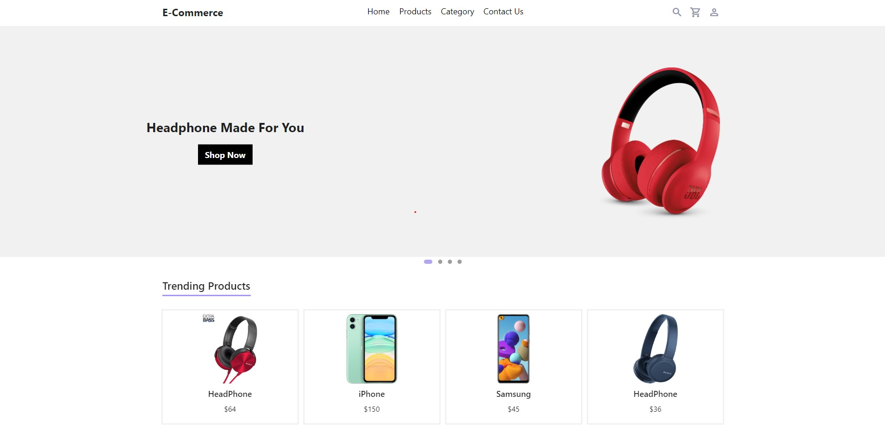

<h1 align="center">IN8_desenvolvedor_teste</h1>

## 🤯 O site é composto por:

- **Home:** Pagina inicial do site;
- **Products:** Rota para a pagina produtos, com lista de produtos e fornecedores;
- **Carrinho:** Carrinho para ver seu itens adicionado;

## Tecnologias 🚀 

Esse projeto foi desenvolvido com as seguintes tecnologias:

- FLUTTER WEB
- DART

## Inicialização do projeto

- Clone o repositório
- instale os pacotes:
- dart pub add http / verifique nas dependencias a versão, alterando para http:^0.12.2
-flutter pub add get / verifique nas dependencias a versão, alterando para   get: ^3.25.4
- instale os pacotes

## Para ininiar

- rode o comando flutter run --no-sound-null-safety --web-renderer html

Feito  by [Vinicius Cordeiro]
